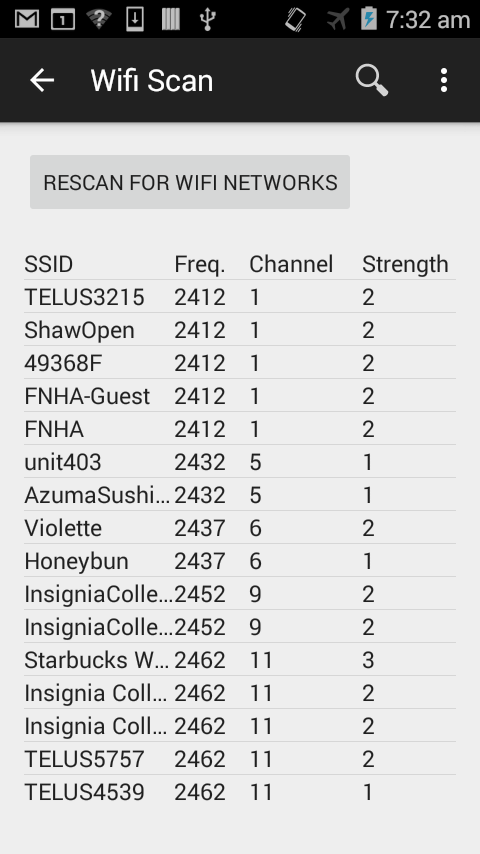
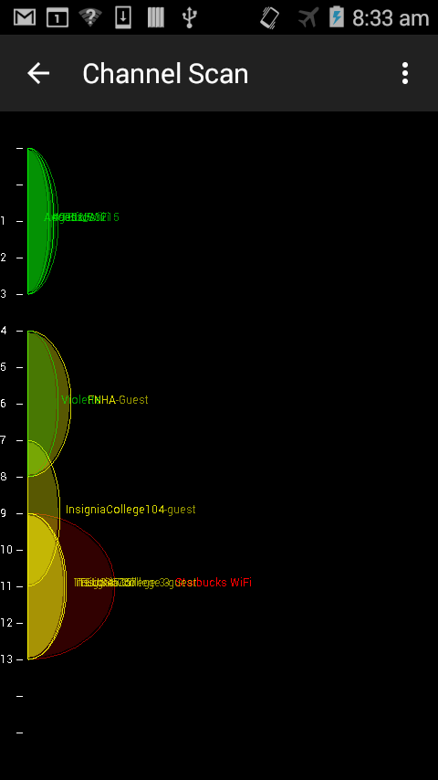
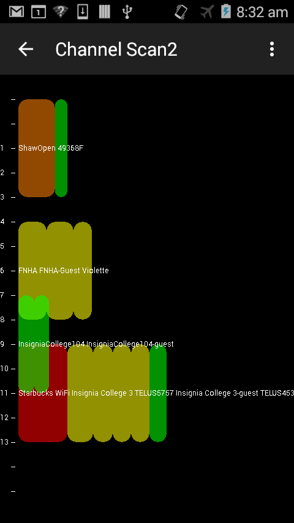

# ftc3
## 3491 Scanner
This app has various screens to display all Wifi networks, what Wifi channels they're using, and signal strengths.

It currently has three display screens:
- The first screen lists all Wifi networks with the channel number they're using in descending strength.
- The second screen shows a graphic display of what networks are using what channel and how strong they are showing overlapping usage as half oval shapes.
- The third screen shows a graphic display of what networks are using what channel as boxes, how strong they are, and how they overlap if they do. Strong networks are red, then orange, yellow to green as they get weaker with the weakest networks excluded.

Screen 1

Screen 2

Screen 3

I'm not very happy with screen 2, too much overlap, too hard to read network names.
I like screen 3 better, the boxes show both strength and overlap and are colour coded.
I would still like to handle names better.

Change History:
- v0.1 Add second screen showing wifi networks as half ovals.
- v0.2 Add third screen displaying wifi networks as boxes
- v0.3 sort Wifi network list by channel then strength, change colours on third screen, apply Java 'lint' fixes.
- v0.4 change colours again, ovals are looking better with outlines highlighted. Names need work.
