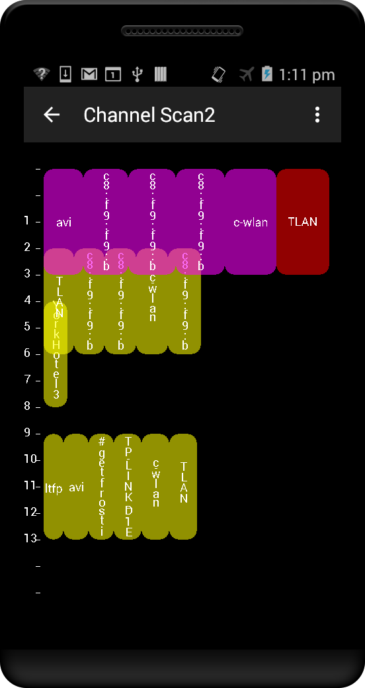
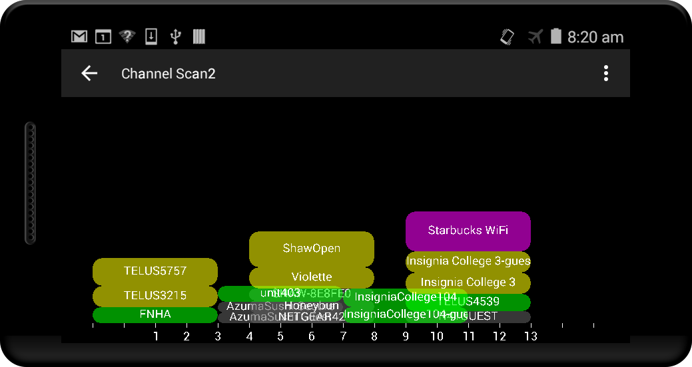
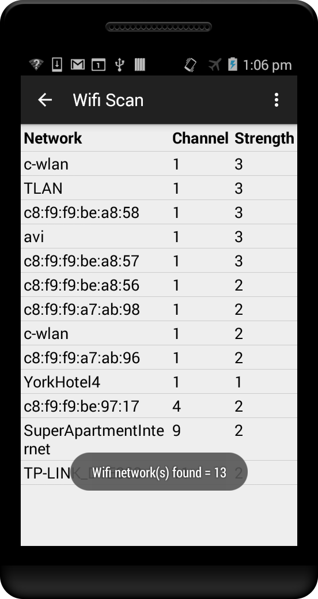
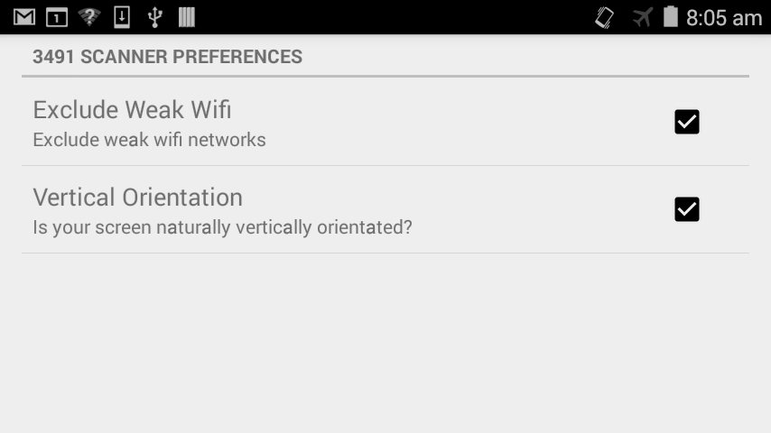

# ftc3
## 3491 Scanner
This app has various screens to display all Wifi networks, what Wifi channels they're using, and signal strengths.

It currently has four display screens:
- The first screen lists all Wifi networks with the channel number they're using in descending strength.
- The second screen shows a graphic display of what networks are using what channel and how strong they are showing overlapping usage as half oval shapes.
- The third screen shows a graphic display of what networks are using what channel as boxes, how strong they are, and how they overlap if they do. Strong networks are red, then purple, yellow and green as they get weaker.
- The fourth screen is the same as one, but Wifi Network names don't truncate. Switched to a TableLayout view with shrinkable name column. Also respects user Display font size preferences.

A Settings screen was added that allows user to choose whether or not to exclude weak wifi networks, and change the orientation of how screen three draws.

Screen 1

Screen 2

Screen 3

Screen 4

Settings Screen

I'm not very happy with screen 2, too much overlap, too hard to read network names.

I like screen 3 better, the boxes show both strength and overlap and are colour coded.
But with large numbers of networks the strong networks can be pushed off narrow screens.

I like screen 4 over 1, names don't truncate and it respects user's font size settings and adjusts to various screen sizes and orientations.

Change History:
- v0.1 Add second screen showing wifi networks as half ovals.
- v0.2 Add third screen displaying wifi networks as boxes
- v0.3 sort Wifi network list by channel then strength, change colours on third screen, apply Java 'lint' fixes.
- v0.4 change colours again, ovals are looking better with outlines highlighted. Names need work.
- v0.5 change colours again, Wifi names in boxes now try to fit horizontally, and if not, they print at an angle within the box. Stronger networks print on top of weaker. Wifi networks font sizes tweaked.
- v0.6 added fourth screen, a better looking Wifi networks list that adjusts to user's screens and preferences.
- v0.7 changed 3rd screen to not angle names in boxes, but print either horizontally or vertically.
- v0.8 added a Settings screen and options to exclude weak wifi networks and change orientation for screen 3
- v0.9 had issue with screen 4 gradients not always drawing properly on different devices. Removed gradients, inserted divider rows instead, which looks better when the SSID field needs more than one row.
- v0.10 display network BSSID if SSID is an empty string on screen 3 and 4. On screen 3, fit strong networks on screen by dropping weak networks if needed.
