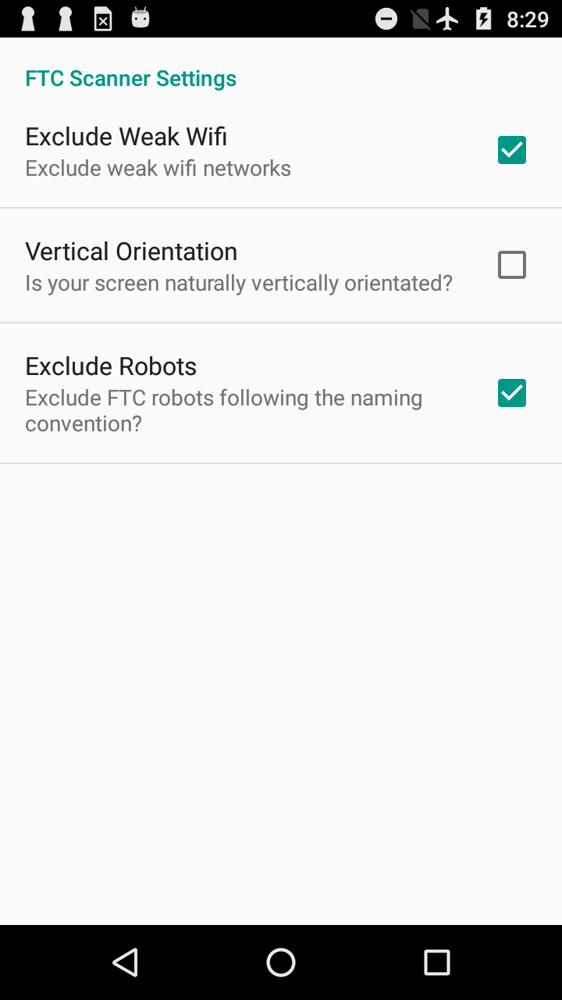

# FTC Scanner
This app has various screens to display all Wifi networks, what Wifi channels they're using, and signal strengths. Now includes filtering of FTC Robot Controllers making it easy to tell what other WiFi networks are running in that location.

It currently has two display screens:
- The first screen shows a graphic display of what networks are using what channel as boxes, how strong they are, and how they overlap if they do. Strong networks are red, then purple, yellow and green as they get weaker.
- The second screen lists networks in WiFi channel order, in descending WiFi strength within a Channel.

A Settings screen was added that allows user to choose whether or not to exclude weak wifi networks, and change the orientation of how screen three draws.

Screen 1

Screen 2

Settings Screen

Change History:
- v0.1 Add second screen showing wifi networks as half ovals.
- v0.2 Add third screen displaying wifi networks as boxes
- v0.3 sort Wifi network list by channel then strength, change colours on third screen, apply Java 'lint' fixes.
- v0.4 change colours again, ovals are looking better with outlines highlighted. Names need work.
- v0.5 change colours again, Wifi names in boxes now try to fit horizontally, and if not, they print at an angle within the box. Stronger networks print on top of weaker. Wifi networks font sizes tweaked.
- v0.6 added fourth screen, a better looking Wifi networks list that adjusts to user's screens and preferences.
- v0.7 changed 3rd screen to not angle names in boxes, but print either horizontally or vertically.
- v0.8 added a Settings screen and options to exclude weak wifi networks and change orientation for screen 3
- v0.9 had issue with screen 4 gradients not always drawing properly on different devices. Removed gradients, inserted divider rows instead, which looks better when the SSID field needs more than one row.
- v0.10 display network BSSID if SSID is an empty string on screen 3 and 4. On screen 3, fit strong networks on screen by dropping weak networks if needed.
- v0.11 gradle upgrade, rename app to FTC Scanner, enable filtering to exclude FTC robot controllers
- v0.12 remove older screens, leaving a graphical screen and a list screen
